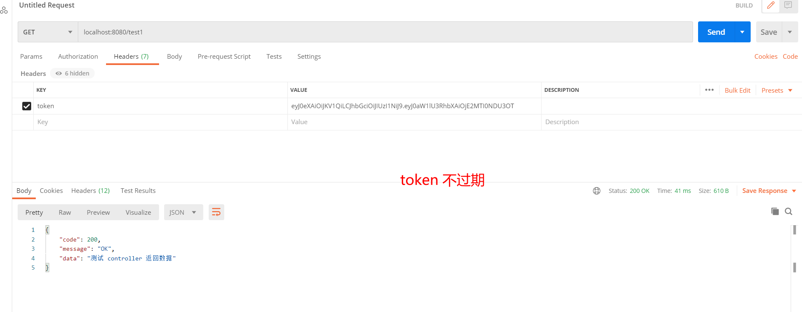
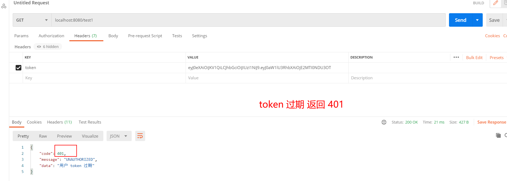

# 记录必要 commit 更新说明
## 2021.02.23
### 1. jarvan/reset-back-liwenhao
## 2021.02.10
### 1. jarvan/feature-cos: 更新cos对象储存
前端请求字段字段名为 `uploadFile`
```json
"uploadFile": 文件
```
后端直接返回请求体
```json
{
    "code": 200,
    "message": "OK",
    "data": "https://bmft-img-1304103443.cos.ap-chongqing.myqcloud.com/leetcode/23191612937129752.png"
}
```
试过了，阿里云的 oss 垃圾，真的，starter oss 会注册失败，
用官网的教程测试成功，但是用地址却拿不到图片，因为需要「备案的域名」
我用了「备案的域名」还是会出现一些奇怪的bug，在oss文件管设置该文件可域名链。算了，
用腾讯 cos 对象储存
测试一切成功，但是在做 api 测试的时候，报错找不到文件，
反复查找之后，因为中文和空格 encode 之后不能自动 decode，所以要将 url 再 decode 一次，
测试成功！！！

## 2021.02.05
### 1. jarvan/fix-sql: 修复数据库，解决数据库字段空格问题

## 2021.02.04

### 3. jarvan/fix-token：添加 token controller 层测试用例

测试类位置 `src/test/java/com/leetcode/token/TokenApiTest03.java`

### 2. jarvan/feature-token：完善 token

1. **token 中包含的 3 个数据**

```json
{
  "userId": "432153151535",
  "userRole": "ROLE_ADMIN",
  "timeStamp" "1341241531"
}
```

而且这三个参数的参数名都用 TokenConstant.java 进行规范

userRole 的 2 个参数 用 UserRoleConstant.java 进行规范

2. 全局异常捕获 GlobalExceptionHandler.java 

3. token 判断和过期判断（过期返回 401）

   

   token 过期返回 401
   

### 1. jarvan/feature-environment:更新数据库；修改实体类；测试插入部分数据
* 我们 id 使用雪花算法 + UUID，在 MyMetaObjectHandler 中自动实现，所以我们设置 id 的时候不用设置 id 的值。因为这个需要使用到 Long 长整型，所以 我们修改数据库，修改实体类

* 修改实体类的自动填充器，自动填充  `createTime`、`updateTime`、`deleted`字段

* 测试插入部分数据 tag list user

2021.2.7
许兴军第一次任务提交
